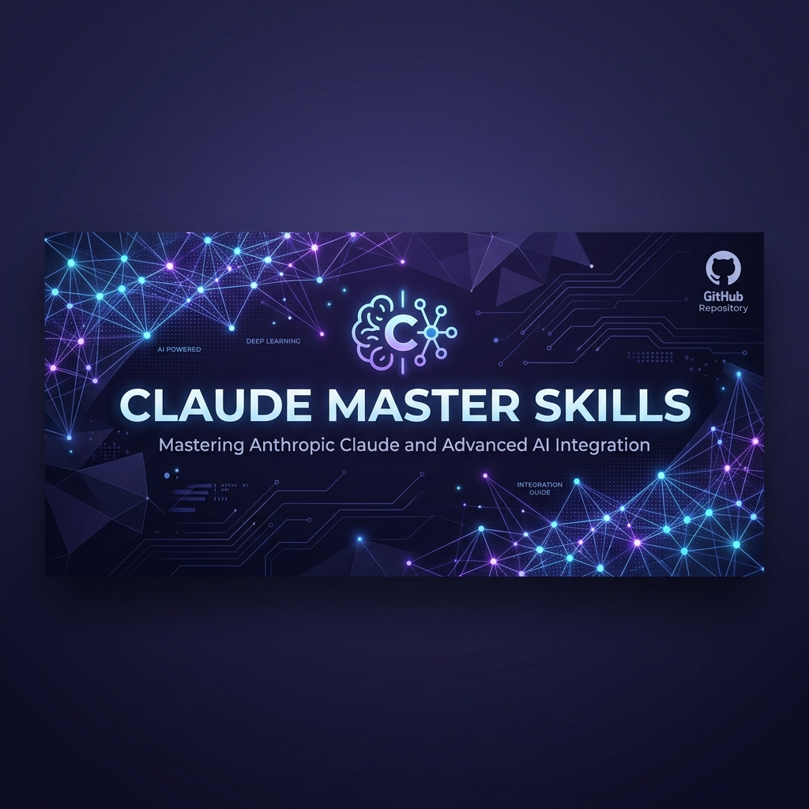
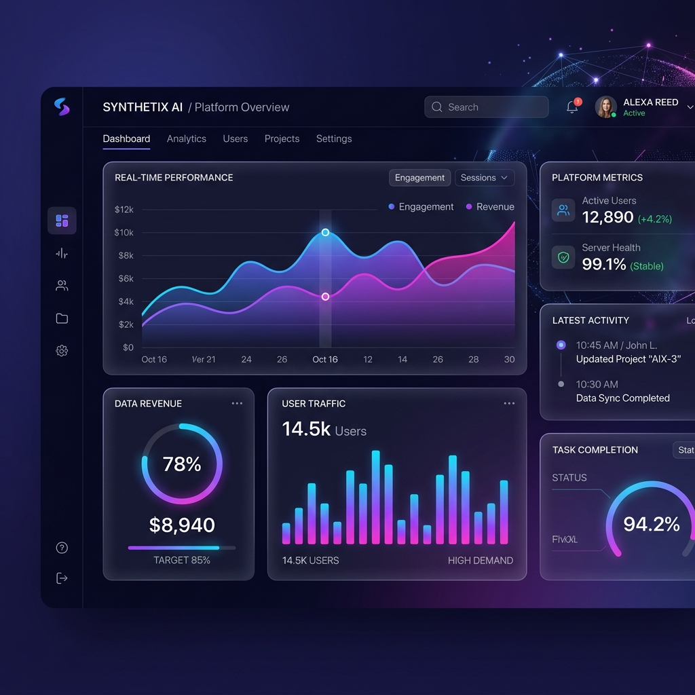

# Claude Master Skills 🚀



> **Supercharge your AI workflows with professional-grade skills and specialized frameworks.**

A curated collection of specialized skills and workflows designed to enhance Claude's capabilities in specific domains. These skills provide frameworks, psychological triggers, and structured processes to deliver high-quality, professional results.

---

## 📂 Skill Gallery

| Skill | Description | Category |
| :--- | :--- | :--- |
| [🐦 Viral Tweet Generator](skills/viral-tweet-generator/SKILL.md) | Transform ideas into high-engagement content on X. | Marketing |
| [📜 Thread Generator](skills/thread-generator/SKILL.md) | Craft compelling threads that hold attention. | Marketing |
| [🛠️ Skill Creator](skills/skill-creator/SKILL.md) | Build, test, and optimize your own custom skills. | Engineering |
| [🚀 Aesthetic UI Engine](skills/aesthetic-ui-engine/SKILL.md) | Generate premium, modern web designs with AI. | Design |
| [📂 Repo Explainer](skills/repo-explainer/SKILL.md) | Deep codebase analysis and architectural mapping. | Engineering |
| [🔍 Code Reviewer](skills/code-reviewer/SKILL.md) | Professional analysis of code quality and security. | Engineering |
| [🔥 Repo Roast](skills/repo-roast/SKILL.md) | Brutally honest and funny critique of your code. | Viral |
| [⚛️ TS Architect](skills/typescript-architect/SKILL.md) | Deep refactoring and complex type safety. | Engineering |
| [📈 SEO Master](skills/seo-content-master/SKILL.md) | Content strategy for high-ranking Google results. | Marketing |
| [🧠 Prompt Pro](skills/prompt-engineer-pro/SKILL.md) | Advanced prompt engineering and agent design. | Engineering |
| [🌊 Workflow Gen](skills/workflow-generator/SKILL.md) | Build custom structured workflows for any project. | Engineering |
| [💎 Prompt Opt](skills/prompt-optimizer/SKILL.md) | Upgrade basic prompts into high-performance instructions. | Engineering |

---

## ✨ Visual Showcase

### Aesthetic UI Engine in Action
The **Aesthetic UI Engine** transformations are designed to make your web apps look premium and state-of-the-art.



---

## 🌊 Workflows

Structured sequences to guide Claude through complex tasks from start to finish.

| Workflow | Goal |
| :--- | :--- |
| [🚀 Startup MVP](workflows/startup-mvp.md) | Go from idea to launched MVP at high velocity. |
| [🔍 Systematic Debugging](workflows/debugging.md) | Reproduce, analyze, and fix bugs reliably. |

---

## 🤖 Hooks & Automation

Skills that automate repetitive developer tasks like commits and documentation.

| Hook | Purpose |
| :--- | :--- |
| [🤖 Auto Commit](hooks/auto-commit/HOOK.md) | Generate semantic commit messages automatically. |
| [📝 Auto Doc](hooks/auto-doc/HOOK.md) | Keep READMEs and comments in sync with code changes. |

---

## 📄 CLAUDE.md Templates

Production-ready memory files to give Claude persistent context for your specific tech stack.

| Template | Purpose |
| :--- | :--- |
| [⚛️ Next.js](claude-md/nextjs-template.md) | App Router, Tailwind, TypeScript standards. |
| [🐘 Laravel](claude-md/laravel-template.md) | PHP, Artisan commands, Service patterns. |
| [🧩 Chrome Extension](claude-md/chrome-extension-template.md) | Manifest V3, Content scripts, Messaging. |
| [📱 Mobile (Expo)](claude-md/mobile-template.md) | React Native, Navigation, Mobile performance. |

---

## 🚀 Getting Started

### 1. Quick Install (Recommended)
Install all skills and hooks into your current project with a single command:

**macOS / Linux:**
```bash
curl -sSL https://raw.githubusercontent.com/learn-with-santosh/claude-master-skills/main/install.sh | bash
```

**Windows (PowerShell):**
```powershell
python setup.py
```

### 2. Manual Integration
If you prefer manual control, copy the desired skill folder from `skills/` into your project's `.claude/skills/` directory. Claude will automatically detect them as `available_skills`.
1. Copy the contents of the desired `SKILL.md` file.
2. Provide it to Claude as context for your session or import it into your custom agent configuration.
3. Follow the input formats described in the skill documentation.

---

## 📈 Roadmap

- [x] Viral Tweet Generator
- [x] Skill Creator
- [x] Aesthetic UI Engine
- [x] Repo Explainer
- [x] Code Reviewer
- [x] Next.js CLAUDE.md Template
- [x] Startup MVP Workflow
- [x] Debugging Workflow
- [x] Auto Commit Hook
- [x] Auto Documentation Hook
- [x] Repo Roast Tool (Phase 6)
- [x] TypeScript Architect
- [x] SEO Content Master
- [x] Prompt Engineer Pro
- [x] AI Workflow Generator
- [x] Prompt Optimizer Tool
- [x] CLAUDE.md Template Library (Next.js, Laravel, Chrome, Mobile)

---

## 🤝 Contributing

We welcome community contributions! Please see our [CONTRIBUTING.md](CONTRIBUTING.md) for guidelines on how to add your own specialized skills.

---

_Created and maintained by [learn-with-santosh](https://github.com/learn-with-santosh)_

